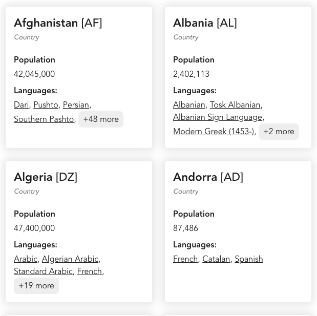
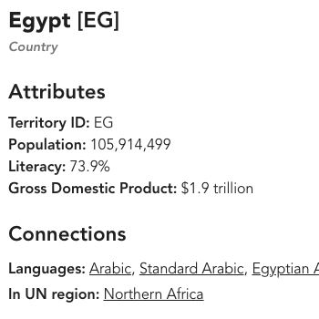
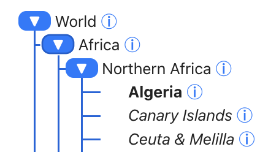
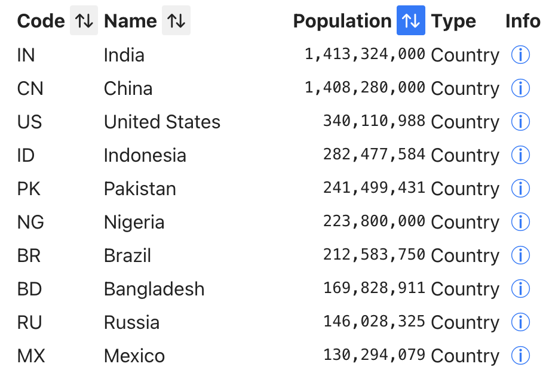
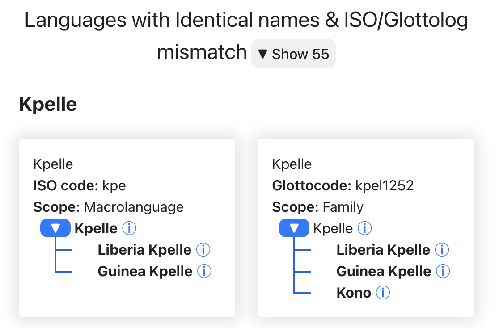

# **Lang**uage **Nav**igator

This repository contain a dataset of metadata about the world's languages and language-like objects as well as a website framework to visualize the information.

There are multiple ways to visualize the data
|Card List|Details|Hierarchy|Table|Warnings|
|--|--|--|--|--|
|||||

## Project Overview

### Motivation

This website was put together to give an overview of the world's languages and language-related concepts. Similar to Ethnologue & Glottolog, the main differences of this are to:
* **Free** & open to all consumers.
* Show **all data**, even contested language definitions. Making sure to put contested data in context.
* Provide **actionable insights** -- make sure the data is clear enough that consumers can come to this page to get answers.

### Tech Stack

* **Frontend**: The website is rendered in Javascript, particularly React using Typescript.
* **Backend**: The framework of the website is written in Node and Vite.
* **Data**: Data files are written in Tab-separated-value format (tsv).

### Partners

We've partnered with various organizations to get data and to provide data to. UNESCO's [World Atlas of Languages](https://en.wal.unesco.org/), [https://hlt.bme.hu/en/dld/](https://hlt.bme.hu/en/dld/)

## Data

The data comes from multiple sources, primarily [CLDR](https://github.com/unicode-org/cldr/), [Ethnologue](https://www.ethnologue.com/), and [Glottolog](https://glottolog.org/).

## Deployment Instructions

In order to generate the website on an internal server, follow these instructions.

1. Install Node Project Manager, see [the official Node documentation for install](https://docs.npmjs.com/downloading-and-installing-node-js-and-npm)
2. Download the repository to your computer -- go to that folder when you are done
3. Run `npm install` to install relevant Node and Vite packageas
4. Run `npm run dev` to start the server with some dev options
  1. or `npm run build`

### Initialization

This is how we created the project originally -- you should not need to run these, but its for background.

2. Initalize the project using vite `npm create vite@latest`
  1. Choose `lang-nav` as project name. Then React + TypeScript
3. Change into the `lang-nav` directory and run `npm install`
4. Setup the linter
  1. Initialize `npx eslint --init`
  2. Choose options: what: javascript, use: problems, modules: esm, framework: react, typescript: yes, runs on: browser
  3. `npm install --save-dev prettier eslint-config-prettier eslint-plugin-prettier`
  4. More magic to get it to run... I had to install ESLint on my IDE (VSCode)
  5. Some plugins were added after the this library was started like `eslint-plugin-import`
5. Import other lirbaries
   1. `npm install react-router-dom`
6. Start `npm run dev`

## How to contribute

## Functionality

Here's a list of planned functionality. Completed functions are checked off.

- [x] Language-adjacent objects
  - [x] Languages
    - [x] Core attributes
    - [x] ISO parent/child connections
    - [x] Language families
    - [x] Glottolog
    - [ ] Digital Support details
  - [x] Territories
    - [x] Countries & Dependencies
    - [x] Continents & other regions
  - [x] Locales (languages + territories + potentially other specificity)
    - [x] Basic data
    - [x] Computed regional locales
    - [ ] Population estimate sources
  - [x] Writing Systems
    - [x] Basic data
    - [x] Relationship w/ other writing systems (containment, lineage)
  - [ ] Language Variants / IANA tags
- [x] Views
  - [x] Cards
  - [x] Details
  - [x] Hierarchy
  - [x] Table
  - [ ] Map
  - [x] Warnings
    - [x] Language name overlap
    - [ ] Invalid languages
    - [ ] Locales that should be added
- [x] Interactivity
  - [x] Filter
    - [x] By Code
    - [x] By Name
    - [x] Highlight search
    - [x] For Hierarchy
    - [x] By Scope
    - [ ] Using typeahead
  - [x] Hovercard & Tooltips
    - [x] Related objects
    - [x] Field explanations
  - [x] Sort By: Population, Name, Code
  - [x] Limit
  - [ ] Selection
  - [ ] Export
- [ ] Manage data sources
  - [x] Load different subsets of data
  - [x] Show results based on different definitions of what a language is
    - [x] ISO, Glottolog, Inclusive
    - [x] Highlight codes in each
- [ ] Future ideas
  - [ ] Database-powered backend
  - [ ] Feedback mechanisms
  - [ ] Metrics
